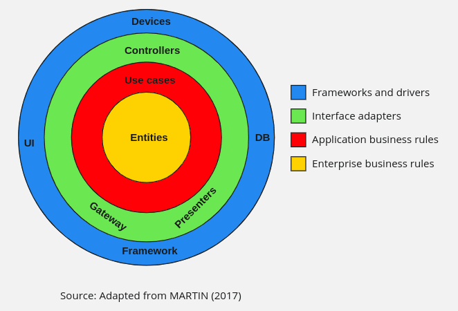

# OAuth

This repo aims implement a clean architecture to develop an Oauth Service that could easily scale to others different Oauths services.


## Folder Struct
Folder struct used for this project:</br>


## Entities
As entities was defined the user information usally consider for these kind of applications and a oauth-information as the information returned by the oauth service.

```Go
type OauthUser struct {
	Name  string `json:"name"`
	Image string `json:"image"`
	Email string `json:"email"`
}
type User struct {
	Name     string   `json:"name" gorm:"not null"`
	Image    string   `json:"image"`
	Email    string   `json:"email" gorm:"unique,not null"`
	Password string   `json:"password"`
	Role     UserRole `json:"role"`
}

```
## Use Case
As use case where defined two services using the repository and inverse dependency patterns:
1.  User Service: Define two functionalities, Save user and searh by email
```Go

func (us *UserService) SaveUser(ctx context.Context, user *entities.User) error {
	return us.UserRepository.SaveUser(ctx, user)
}

func (us *UserService) GetUser(ctx context.Context, email string) (*entities.User, error) {
	return us.UserRepository.GetUserByEmail(ctx, email)
}

```
2. OauthService: Was defined whit the next functionality:
```Go

func (s *OauthService) GetInfoUser(ctx context.Context, code string) (*entities.OauthUser, error) {

	token, err := s.OauthRepository.GetAccessToken(ctx, code)
	if err != nil {
		return nil, err
	}
	return s.OauthRepository.GetInfoUser(ctx, token)
}
```
In this layer also was defined the interfaces for the repositories needed for these services.
## Interfaces
In this layer was implemented the repositories defined in the **Use Case** layer. Additionally also was implemented the controllers and the way to read the configuration for this project.
## External interface
In this layer was used the framework **fiber** to create the micro-service that allows get the information throught OAuth implementation made it in the above layers.